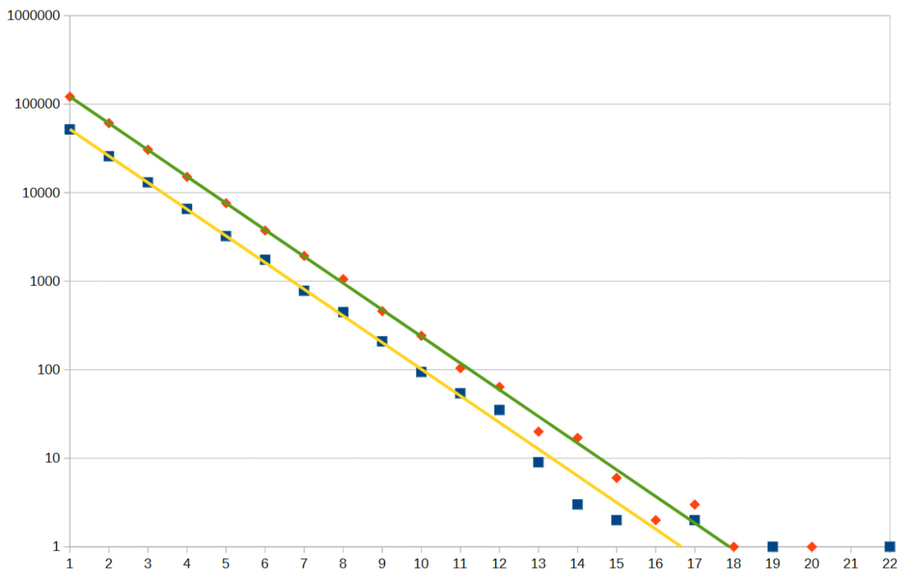
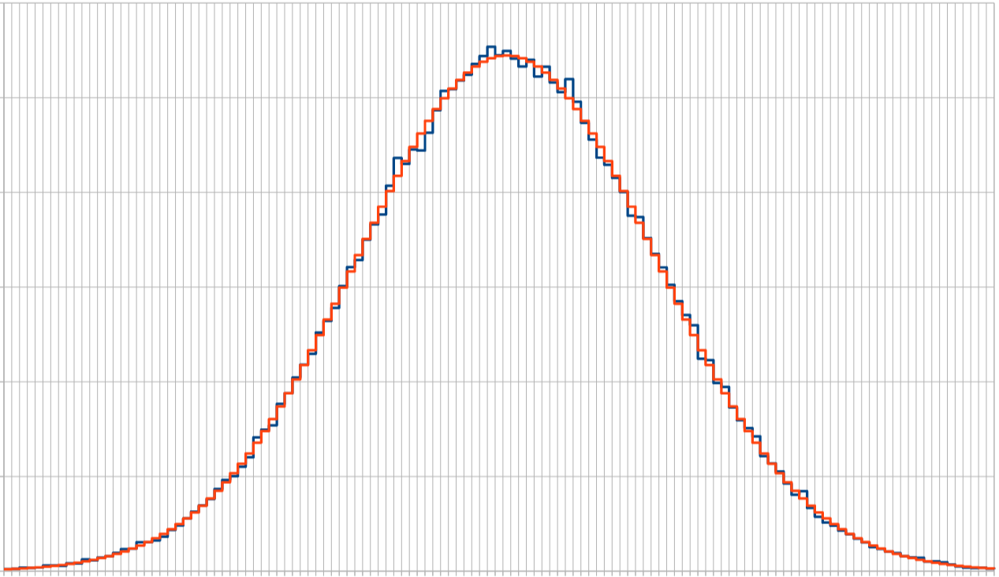
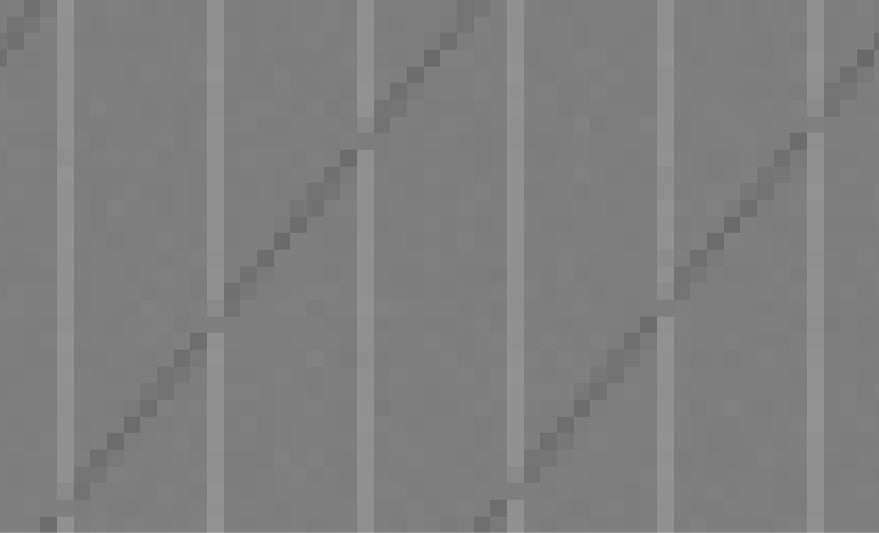
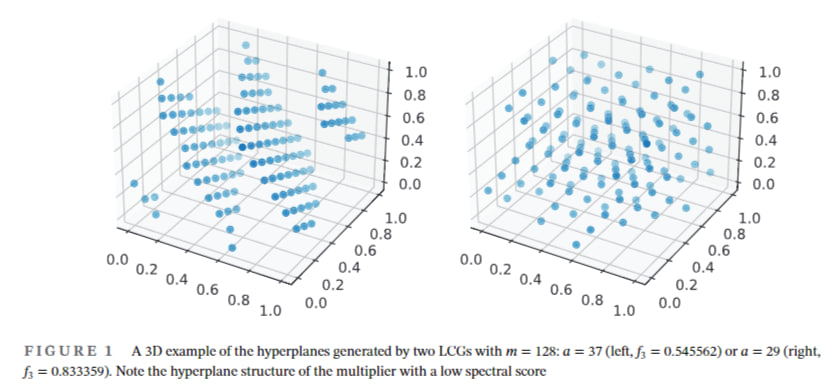

# Критерий нормальности Колмогорова-Смирнова

## Постановка задачи

Мы исследуем отклонение распределения гистограммы эмпирического распределения от теоретического или другого распределения. Прежде всего нас интересует поиск отклонения от нормального распределения, заданного функцией CDF — кумулятивной функцией распределения вероятности.

1. Мы хотим доказать или опровергнуть гипотезу нормального распределения положительных исходов $H_0$. 
2. Мы исходим из предположения, что распределение с большим фиксированным временем накопления может оказаться ниже, чем распределение с динамическим управлением заданиями (окном).
3. При нормальном законе распределения мы планируем сформулировать критерий, который бы подходил для раннего выявления нерабочих режимов оборудования генерации случайных чисел. 

Мы добавляем в ПО возможность анализа статистических данных и проверки гипотезы о нормальном распределении вероятности при данной выборке.

Возможные нерабочие состояния оборудования генерации ГПСЧ. Оборудование может эксплуатироваться вне рабочих режимов при повышении тактовой частоте, занижения напряжения питания и ограничения по времени окна накопления данных. Формально работоспособность можно проверить только путем загрузки тестовых заданий (seed/nonce), на которые известна тестовая последовательность отклика. Но этот метод не всегда доступен. Если оборудование частично неработоспособно, то при параллельной генерации часть диапазона не будет отсылать отклики, создавая паттерн в значениях. Паттерны могут проявляться в графическом, тензорном представлении. Статистика оперирует со случайными выборками, т.к. в нашем случае часть оборудования параллельной генерации может не отвечать в течение коротких или продолжительных не прогнозируемых интервалов времени. Некоторая неоднородность может возникать в процессе сбора данных из-за коллизий на линии. 

Нормальный закон распределения плотности вероятности будет выражаться в терминах математического ожидания и дисперсии. Для математической оценки отклонения используются различные критерии, среди которых выделяется критерий Колмогорова-Смирнова, критерий Пирсона. Нас прежде всего интересуют методы основанные на вероятности распределения и дающие строго математический критерий применимый к однородному или нормальному распределению плотности вероятности. Сам алгоритм генерации так же может иметь некоторую скрытую неоднородность, которая проявляется на специфичных значениях (seed/nonce). Для исследования и моделирования поведения аппаратных генераторов мы используем простые 64 битные генераторы с большим периодом повтора, в частности MWC64/128 и Xoroshiro64/128. Обработка статистических данных с аппаратного генератора возможна с использованием файла выборочных значений из потоковых данных. Файл содержит данные подобные тесту Max Runs length с временными метками возникновения длинной последовательности нулей в потоке генерации. Длины прогонов единиц и ноликов (Runs) можно анализировать статистическими тестами.


CDF (Кумулятивная функция распределения для нормального распределения вероятности) — это функция, которая показывает вероятность того, что случайная величина $X$ примет значение меньше или равное заданному числу $x$, т.е. $P(X \le x)$. CDF является возрастающей функцией, начинается с 0 и достигает 1, преобразуя функцию плотности вероятности (PDF) в накопленное значение вероятности до точки $x$.

Положим, что $X$ распределена _нормально_. Тогда CDF для $X$ задается формулой:
```math
F(t; \mu, \sigma) = \frac{1}{\sigma \sqrt{2\pi}} \int_{-\infty}^{t} \exp\left( -\frac{(x - \mu)^2}{2\sigma^2} \right) \, dx.
```
Здесь параметр $\mu$ — это математическое ожидание распределения, а $\sigma$ — его стандартное отклонение.

Положим, что $X$ распределена _биномиально_. Тогда CDF для $X$ задается формулой:
```math
F(k; n, p) = \Pr(X \le k) = \sum_{i=0}^{\lfloor k \rfloor} \binom{n}{i} p^i (1-p)^{n-i}.
```
Здесь $p$ — вероятность успеха, функция описывает дискретное распределение числа успехов в последовательности из $n$ независимых экспериментов, а $\lfloor k \rfloor$ — "пол" под $k$, т.е. наибольшее целое число, меньшее или равное $k$.

Рекомендации по анализу статистики представлены в ГОСТ Р 50.1.033-2001 и ГОСТ Р 50.1.037-2002:

- [Р 50.1.033-2001] РЕКОМЕНДАЦИИ ПО СТАНДАРТИЗАЦИИ. Прикладная статистика. Правила проверки согласия опытного распределения с теоретическим. Часть I. Критерии типа хи-квадрат.
- [Р 50.1.037-2002] РЕКОМЕНДАЦИИ ПО СТАНДАРТИЗАЦИИ. Прикладная статистика. Правила проверки согласия опытного распределения с теоретическим. Часть II. Непараметрические критерии (рассматривает критерий Колмогорова и критерий Смирнова).

См. также:
- [Kolmogorov–Smirnov test](https://en.wikipedia.org/wiki/Kolmogorov%E2%80%93Smirnov_test)
- [Normality test](https://en.wikipedia.org/wiki/Normality_test)

## Критерий согласия Колмогорова

Применение критерия согласия А. Н. Колмогорова в практике осложняется следующими обстоятельствами. Для сопоставления функций эмпирического и теоретического распределений необходимо знать значения математического ожидания и среднего квадратического отклонения наблюдаемой случайной величины, которые обычно неизвестны.

В 1933 г. А. Н. Колмогоров доказал важную теорему: если функция $F(x)$ непрерывна, то при $n \to \infty$ вероятность события $\sup_x |F_n(x) - F(x)| < t / \sqrt{n}$ стремится к распределению Колмогорова.

**Формулировка**

Пусть $X_1, \ldots, X_n$ — выборка объёма $n$, порождённая случайной величиной, которая задаётся непрерывной функцией распределения $F(x)$. Пусть $F_n(x)$ — эмпирическая функция распределения. Тогда $\sqrt{n} \sup_{x \in \mathbb{R}} |F_n(x) - F(x)| \to K$ по распределению при $n \to \infty$, где $K$ — случайная величина, имеющая распределение Колмогорова.

*Неформально говорят, что скорость сходимости эмпирической функции распределения к её теоретическому аналогу имеет порядок $1/\sqrt{n}$.

Обозначим нулевую гипотезу $H_0$ как гипотезу о том, что выборка подчиняется распределению $F(x) \in C^1(\mathbb{X})$. Тогда по теореме Колмогорова для введённой статистики справедливо:
```math
\forall t > 0 \colon \lim_{n \to \infty} P(\sqrt{n} D_n \leqslant t) = K(t) = \sum_{j=-\infty}^{+\infty} (-1)^j e^{-2j^2 t^2} = \theta_4(e^{-2t^2}),
```
где $D_n = \sup_x |F_n(x) - F(x)|$.

**Теорема Смирнова**

Пусть $F_{1,n}(x)$, $F_{2,m}(x)$ — эмпирические функции распределения, построенные по независимым выборкам объёмом $n$ и $m$ случайной величины $\xi$. Тогда, если $F(x) \in C^1(\mathbb{X})$, то
```math
\forall t > 0 \colon \lim_{n,m \to \infty} P\left( \sqrt{\frac{nm}{n+m}} D_{n,m} \leqslant t \right) = K(t) = \sum_{j=-\infty}^{+\infty} (-1)^j e^{-2j^2 t^2},
```
где $D_{n,m} = \sup_x |F_{1,n}(x) - F_{2,m}(x)|$.

Теорема Смирнова позволяет построить критерий для проверки двух выборок на однородность.

## Критерий согласия Кёйпера (KS_Kuiper)

> Изначально, я смотрел в код проекта `Dieharder` (набор тестов для проверки ГПСЧ), где применяется ряд вариантов теста KS, включая тест Кёйпера. В этой связи, следует упомянуть критерий. Теорема Колмогорова порождает много вариантов оценки статистики. Многие методы в прикладной статистике кажутся математически не обоснованными. Например, применение метода для нормального распределения при условии, что в ядре операции выполняется сравнение с линейной функцией - недопустимо. 

Мы отдельно рассматриваем левые и правые отклонения, относительно нормального распределения $F(x,\theta)$, $D_{n}^{+}$ и $D_{n}^{-}$. В критерии Кёйпера используется статистика вида: 
$V_{n}=D_{n}^{+}+D_{n}^{-}$.

Критерий согласия Кёйпера (Купера) является вариантом критерия согласия Колмогорова и был предложен для проверки простых гипотез о принадлежности анализируемой выборки полностью известному закону, то есть для проверки гипотез вида 
$H_{0}:F_{n}(x)=F(x,\theta )$ с известным вектором параметров теоретического закона.

Для однородного распределения используется сравнение с линейной кумулятивной функцией однородного распределения $F(x)=i/n$, нижняя и верхняя оценка:
```math
D_{n}^{+}=\max {\left({\frac {i}{n}}-F(x_{i})\right)},   
```
```math
D_{n}^{-}=\max {\left(F(x_{i})-{\frac {i-1}{n}}\right)}~, 
 ~~i={1,...n} ,  
```
$n$ — объём выборки, $x_{1},x_{2},...,x_{n}$ — упорядоченные по возрастанию элементы выборки.

## Критерий Крамера — Мизеса — Смирнова

$\omega^2$-статистика Мизеса. Cramér–von Mises test

Базовая идея - рассмотрение интеграла отклонения эмпирической кумулятивной функции от непрерывной кумулятивной функции нормального распределения.
```math
\omega ^{2}=\int _{-\infty }^{\infty }[F_{n}(x)-F^{*}(x)]^{2}\,\mathrm {d} F^{*}(x)
```

Далее почему-то вместо кумулятивной функции нормального распределения возникает сравнение с линейной функцией (кумулятивной функцией однородного распределения). 

```math
S=n\omega ^{2}={\frac {1}{12n}}+\sum _{i=1}^{n}\left[F_{n}(x_{i}) - {\frac {2i-1}{2n}}\right]^{2}.
```
> Магия числа 12 не ясна. Очевидно эта поправка, для согласования критерия при малых $n$, связанная со способом дискретизации данных. 

## Критерий Андерсона-Дарлинга

$\Omega^2$-статистика Мизеса. Anderson–Darling test

The Anderson–Darling and Cramér–von Mises statistics belong to the class of quadratic EDF statistics (tests based on the empirical distribution function).[2] If the hypothesized distribution is 
$F$, and empirical (sample) cumulative distribution function is 
$F_{n}$, then the quadratic EDF statistics measure the distance between 
$F$ and $F_{n}$ by
```math
\Omega^{2}=n\int _{-\infty }^{\infty }{\left[F_{n}(x)-F(x)\right]}^{2}\,w(x)\,dF(x),
```
где $n$ число элементов выборки, $w(x)$ - весовая функция. 

В случае 
$w(x)=1$, используется статистика Крмаера-Мизеса (Cramér–von Mises). Тест Андерсона-Дарлинга (Anderson–Darling) (1954) основан на квадратичной дистанции
```math
\Omega^{2}=n\int _{-\infty }^{\infty }{\frac {{\left[F_{n}(x)-F(x)\right]}^{2}}{F(x)\left(1-F(x)\right)}}\,dF(x),
```
с весовой функцией 
$w(x)={\left[F(x)\left(1-F(x)\right)\right]}^{-1}$. В таком виде тест может быть более чувствителен к отклонениям на краях распределения. 

Формулу можно упростить используя асимптотику, для случая однородного распределения:

```math
S_{\Omega }=-n-2\sum _{i=1}^{n}\left\{{\frac {2i-1}{2n}}\ln(F(x_{i},\theta ))+\left(1-{\frac {2i-1}{2n}}\right)\ln(1-F(x_{i},\theta ))\right\},
```

где $n$ — объём выборки, 
$x_{1},x_{2},...,x_{n}$ — упорядоченные по возрастанию элементы выборки.

* Anderson T. W., Darling D. A. Asymptotic theory of certain «goodness of fit» criteria based on stochastic processes // Ann. Math. Statist. — 1952. — V. 23. — P. 193—212.
* Anderson T. W., Darling D. A. A test of goodness of fit // J. Amer. Stist. Assoc., 1954. — V. 29. — P. 765—769.

> Хочется упростить статистику применительно к однородному распределению. Кумулятивная функция однородного распределения $F(x) = x$. Для анализа мы рассматриваем квадратичное отклонение от непрерывного распределения $F(x)$. И это должно напоминать среднеквадратичное отклонение. В идеале надо выражать нормировку отклонения в терминах функции распределения вероятности. И таким образом, мы приходим к критерию Пирсона. Следовало бы начать изложение с критерия Пирсона. Или вывести формулу критерия из формулы Байеса для полной вероятности. Далее рассмотреть асимптотику приводящую к использованию логарифмов в критериях нормальности, подобно тому как логарифмы возникают в машинном обучении.


## Xи-квадрат статистика Пирсона

Данный раздел, следует начать с математической статистики.\
[1] Б. А. СЕВАСТЬЯНОВ КУРС ТЕОРИИ ВЕРОЯТНОСТЕЙ И МАТЕМАТИЧЕСКОЙ СТАТИСТИКИ
> Я выделяю этот учебник, потому что он соответствует подготовке научной школы Колмогорова. Мне не нравится вводить критерии без обоснования. Большинство эмпирических методик тестирования ГПСЧ опираются на $\chi^2$- статистику Пирсона. <!-- По теоретическим основам в математике того времени можно проследить связь между методом доказательства теоремы Вейерштрасса с использованием гауссова ядра, с утверждением, что любую функцию на интервале можно аппроксимировать полиномами, доказательством Бернштейна, с использованием биномиального распределения, вывода полиномов Бернштейна. Общей тенденцией в мат. физике переход к обобщенным функциям через свертку. Построение новой математики и физики на базе Гильбертово пространства собственных функций (вероятностного пространства). Аксиоматики Колмогорова и теория функции. Введение понятия обобщенных, общих и базовых функций. Доказательство двух аппроксимационных теорем Колмогорова-Арнольда и универсальной аппроксимации на сигмоидных (CDF) функциях. -->


В соответствии с заданным разбиением подсчитывают число 
$n_{i}$ выборочных значений, попавших в $i$-й интервал, и вероятности попадания в интервал
$P_{i}(\theta )=F(x_{(i)},\theta )-F(x_{(i-1)},\theta )$,
соответствующие теоретическому закону с функцией распределения $F(x,\theta )$.
Статистика критерия согласия $\chi ^{2}$ Пирсона определяется соотношением
```math
\chi ^{2}=n\sum _{i=1}^{k}{\frac {\left(n_{i}/n-P_{i}(\theta )\right)^{2}}{P_{i}(\theta )}}.
```

**Пример использования**

Выдержка из документации TestU01:

```c
void sstring_Run (unif01_Gen *gen, sstring_Res3 *res,
                  long N, long n, int r, int s);
```

Это вариант **теста на серии единиц** (run test), приспособленный для битовой строки. 

В битовой строке длины n серии последовательных единиц (1) можно рассматривать как **зазоры** (gaps) между блоками последовательных нулей (0). Длины этих зазоров (или серий) являются независимыми **геометрически распределёнными** случайными величинами, увеличенными на 1; то есть вероятность того, что длина серии равна $i$, составляет $2^{-i}$ для $i = 1, 2, …$. Естественно, то же самое верно, если поменять местами 0 и 1 и рассматривать серии нулей.

Тест строит битовую строку до тех пор, пока не получим ровно **n серий единиц** и **n серий нулей**, то есть всего **2n серий**.

Выбираем некоторое целое положительное число k.  
Для j = 0 и j = 1 обозначим:

- $\chi_{j,i}$ — количество серий j-битов длины i, для i = 1, …, k−1  
- $\chi_{j,k}$ — количество серий j-битов длины ≥ k

При справедливости нулевой гипотезы $H_0$ (битовая строка случайна) для каждого $j$ вектор  
(X_{j,1}, …, X_{j,k−1}, X_{j,k}) имеет **мультиномиальное (многомерное биномиальное) распределение** с параметрами  
(n, p₁, p₂, …, p_{k−1}, p_k),  
где  
* $P_i = 2^{-i}$ для $1 ≤ i < k$
* $P_k = 2^{-(k-1)}$,  то есть p_k = p_{k-1}

Тогда, если величина $n·P_k$ достаточно велика, статистика Xи-квадрат

```math
\chi ^{2}=n\sum _{i=1}^{k}{\frac {\left(n_{i}/n-P_{i}(\theta )\right)^{2}}{P_{i}(\theta )(1-P_{i}(\theta ))}}.
```


приближённо имеет **распределение хи-квадрат** с **k−1** степенями свободы.

Более того, величины $\chi_0^2$ и $\chi_1^2$ приближённо **независимы**, поэтому их сумма $\chi^2 = \chi_0^2 + \chi_1^2$

приближённо подчиняется распределению хи-квадрат с **2(k−1)** степенями свободы.



Рис. Пример распределения серий прогонов нулей, в логарифмическом масштабе для генератора типа Hash-DRNG. Представлены две независимые выборки и геометрическое распределение для каждой.

## Тест Шапиро-Уилка

Тест Шапиро-Уилка — это популярный статистический метод для проверки, насколько выборка данных соответствует нормальному (гауссову) распределению, особенно эффективный для малых и средних выборок (до 2000 наблюдений). Он сравнивает упорядоченные значения выборки с ожидаемыми значениями нормального распределения, возвращая p-value: если p > 0.05, данные считаются нормальными; если p ≤ 0.05, нормальность отвергаем (отклоняем нулевую гипотезу).

Основные моменты:
- **Цель**: Определить, принадлежат ли данные нормальному распределению.
- **Гипотезы**: $H_0$ (Нулевая гипотеза): Данные распределены нормально. $H_1$ (Альтернативная): Данные не распределены нормально.
- **Принцип работы**: Основан на сравнении квантилей выборки с квантилями идеального нормального распределения. Статистика теста $W$ вычисляется как:
```math
W = \frac{\left( \sum_{i=1}^n a_i x_{(i)} \right)^2}{\sum_{i=1}^n (x_i - \bar{x})^2},
```
где $x_{(i)}$ — упорядоченные значения выборки, $a_i$ — коэффициенты, зависящие от $n$.
- **Интерпретация p-value (уровень значимости)**:
  - p-value > 0.05: Нет оснований отвергать $H_0$, данные можно считать нормальными.
  - p-value ≤ 0.05: Отвергаем $H_0$, данные значительно отличаются от нормального распределения.
- **Преимущества**: Считается одним из наиболее мощных тестов для проверки нормальности, особенно хорош для небольших выборок.
- **Ограничения**: Для очень больших выборок (>5000) рекомендуется использовать другие тесты, такие как тест Андерсона-Дарлинга.

См. также: [Shapiro–Wilk test](https://en.wikipedia.org/wiki/Shapiro%E2%80%93Wilk_test).

## Дополнительные критерии нормальности

Помимо упомянутых, существуют другие тесты на нормальность:
- **Тест Андерсона-Дарлинга**: более чувствительная к отклонениям на краях распределения.
- **Тест Лиллиефорса**: Модификация Колмогорова-Смирнова для случаев, когда параметры распределения оцениваются по выборке.
- **Тест Жарке-Бера**: Основан на асимметрии и эксцессе, эффективен для больших выборок.
- **Критерий хи-квадрат (Pearson)**: Для проверки согласия с любым распределением, включая нормальное, требует дискретизации данных.

## Криптографические генераторы Hash-DRNG и CTR-DRNG

[[NIST SP 800-90Ar1](https://doi.org/10.6028/NIST.SP.800-90Ar1)] Recommendation for Random Number Generation Using Deterministic Random Bit Generators.

Национальный стандарт NIST предлагает два варианта криптографических генераторов:
1. использовать в качестве основы хэш-функцию типа SHA256 или SHA3.
2. использовать блочный шифр AES в режиме CTR.

Обозначим общую идею использования криптографической хэш-функции в режиме Hash-DRNG. 
Оговорка. В SHA3 функция KECCAK может использоваться в режиме генерации потока бит (SPONGE-SQUEEZE алгоритм - отжимание губки), см SHAKE. В SHA2 хэш-функция может применяться по-блочно. Для генерации используется хэш функция в режиме генерации потока бит,заданной длины `returned_bits = HashGen(bit_len, V)`. Аргументом является предыдущее состояние (`V`). Новое состояние `H = Hash(V); V = V+H+C+Seed`- это рандомизация счетчика `C`, состояния `V` и `Seed`, с использованием той же хэш-функции.

К генератором случайных чисел (PRNG) можно применить требования:
1. Функция перебора состояний без повторов с псевдослучайным выходом.
2. Функция рандомизации выходных значений для заданной длины (бит).

На примере алгоритма MWC64x:

Состояние представлено, как пара чисел {x,c}: $S = (x+\beta c) \bmod P$, где $P = A\beta-1$, $\beta=2^s$.
1. Итерация выполняется на математической операции: $S = S\beta^{-1} \bmod P$.
2. Рандомизация (скрамблер) выходного значения: $x \oplus c$;


## Пакеты тестирования ГПСЧ

Существуют пакеты тестирования генераторов, которые позволяют сравнить в различных тестах. На практике используют тесты вроде NIST SP 800-22 (dieharder, TestU01) для проверки равномерности вывода бит генератора. По результатам теста генератор принимается нормальным или отвергается.

**NIST, TestU01 и Dieharder**

Сборка пакета тестирования TestU01 под GNU/Linux:
```sh
$ mkdir TestU01
$ cd TestU01
$ curl -OL http://simul.iro.umontreal.ca/testu01/TestU01.zip
$ unzip TestU01.zip
$ export basedir=`pwd`
$ cd TestU01-1.2.3/
$ ./configure --prefix="$basedir"
$ make -j 8
$ make -j 8 install
$ cd ../
$ mkdir lib-so
$ mv lib/*.so lib-so/.
$ gcc -std=c99 -Wall -O3 -o test-xoroshift.c test-xoroshift.c -Iinclude -Llib -ltestu01 -lprobdist -lmylib -lm
```

Для примера приведу результаты тестирования [Xoroshiro64*](test/test-xoroshiro64.txt) и [MWC64x](test/test-mwc64x.txt). 

```c 
/* тест MWC64x с использованием библиотеки TestU01 */
#include "TestU01.h"
#define A1 0xFFFEB81BuLL
static uint64_t state[1]={~0};
static uint32_t mwc64x(void) {
    uint64_t x = state[0];
    state[0] = A1*(uint32_t)(x) + (x>>32);
    return x^(x>>32);
}
int main()
{
    // Create TestU01 PRNG object for our generator
    unif01_Gen* gen = unif01_CreateExternGenBits("MWC64x", mwc64x);
    // Run the tests.
    bbattery_SmallCrush(gen);
    // Clean up.
    unif01_DeleteExternGenBits(gen);
    return 0;
}
```
Заметим, что в метод MWC64 добавлена операция XOR: `x ^ (x>>32)`. Я бы назвал это словом "рандомизатор" или "скрамблер", эта операция позволяет улучшить прохождение некоторых тестов. С той же целью, в метод `Xoroshiro64` добавлено умножение результата итерации на большое простое число. Авторы метода [xoroshiro](https://prng.di.unimi.it/) предлагают несколько таких "скрамблеров", отчего алгоритмы отмечаются звездочками и плюсиками. 
```c
const uint64_t result_plus = s0 + s1;
const uint64_t result_plusplus = rotl(s0 + s1, R) + s0;
const uint64_t result_star = s0 * S;
const uint64_t result_starstar = rotl(s0 * S, R) * T;
```
Скрамблер - это линейное или нелинейное отображение, при заданной ширине слова, сохраняющее число состояний. 

Для тестирования и сравнения генераторов предлагают методику *Hamming–Weight Dependencies* [HWD](https://prng.di.unimi.it/hwd.php). В публикации авторы ссылаются на ряд тестов "Hamming–Weight" из пакета TestU01, присутствующие в наборе Crush-тестов. Метод тестирования 64 битных генераторов, сводился к отдельному тестированию старшей и младшей части.

Для улучшения прохождения тестов авторы рекомендуют использовать старшие биты выхода генератора при переводе в вещественные числа.

Метод преобразования, который реализует этот тезис выглядит следующим образом
```c
float to_float(uint32_t x) {
    return (x>>8)*0x1.p-24f;
}
double to_double(uint64_t x) {
    return (x>>11)*0x1.p-53;
}
```
Аналогично, в наших тестах при работе с MWC64 мы использовали преобразование
```c
/* преобразование чисел в формат float32 дает распределение [0,1) */
static inline float u64_float(uint64_t x) {
	return ((uint32_t)((x>>32) ^ (x&0xFFFFFFFFU)) >> 8) * 0x1.0p-24f;
}
```

Пакет TastU01 предлагает _два_ метода инициализации и использования генератора. Первый вариант мы протестировали - он на выходе дает значение 32 бита на итерацию. Второй вариант работает в вещественных числах double и задает функцию генератора, как `double(*gen)()`:
```c
double uniformX () {
    return (((uint64_t)mwc64_next()<<21))*0x1.0p-53;
}
int main() {
    unif01_Gen* gen = unif01_CreateExternGen01("MWC64x-U[0,1)", uniformX);
    bbattery_SmallCrush(gen);
    return 0;
}
```
По ссылке представлены результаты теста [MWC64x](test/testu01-mwc64.txt) в режиме генератора однородного распределения U(0,1). Для сравнения привожу результаты теста [Xoroshiro64*](test/testu01-xoroshiro64.txt) при тех же условиях.

Для генерации однородного распределения float U(0,1) на GPU мы рекомендуем использовать MWC64x. Для генерации в формате double следует использовать генераторы 128 бит, такие как MWC128 и Xoroshiro128.

## Выборочное тестирование с использованием TestU01

Полный набор тестов из 100-150 методов может занимать существенно много времени. Следует выбрать методы наиболее подходящие для решения конкретной задачи. Тестовая задача - выбор параметров генерации MWC64/128 и выбор скрамблера выходных данных. При этом нас интересует использование генератора в режиме генерации однородного распределения U(0,1) в задачах моделирования физических процессов, таких как молекулярная динамика. 

Скрамблеры - нелинейное преобразование. Источник идей - алгоритмы SHA1, SHA2, SHA3. Скрамблеры в алгоритмах Xoroshiro. 

Скрамблеры - линейное преобразование.
* Грей код - обладает уникальным свойством в итерации меняется только один бит.
* Скрамблеры на циклических сдвигах и XOR.
* Скрамблеры на полиномиальной арифметике, используются нередуцируемые полиномы. 
* Скрамблеры на аффинных преобразованиях.

Грей код в тестах применяется для выявления корреляций, а не как целевое решение. В генераторах ГПСЧ применять НЕ рекомендуется.

Зачем нам понадобились скрамблеры. Допустим мы иследуем некоторый генератор ГПСЧ, аргумент функции содержит seed и счетчик-итератор, который может увеличиваться линейно. Наш тест - проверить, как виляет применение линейного или нелинейного итератора на однородность распределения в различных статистиках и сравнить с линейным. Применяется статистика: AD, KS, $\chi^2$.

*Далее раздел дополнен домыслами Qwen3-MAX по выбору тестов из набора Crush* После чего мы просмотрели кажду методику на пригодность.

Для выбора параметров генератора MWC64/128 и оценки эффективности линейных и нелинейных скрамблеров в задачах моделирования физических процессов (молекулярная динамика) можно использовать целевую подвыборку тестов из набора Crush пакета TestU01. Эта подвыборка фокусируется на выявлении артефактов, критичных для многомерной равномерности и линейных зависимостей, при этом остаётся выполнимой по времени (в отличие от полного набора тестов BigCrush).

**Критерии отбора тестов при подборе парметров ГПСЧ и скрамблеров**

* Многомерная равномерность — критична для молекулярной динамики, где последовательности используются для генерации координат/скоростей в 3D-пространстве и во времени.
* Чувствительность к линейным структурам — для оценки эффективности линейных скрамблеров (Грей-код, аффинные преобразования).
* Чувствительность к нелинейным зависимостям — для проверки скрамблеров, вдохновлённых хэш-функциями (SHA) и Xoroshiro.
Битовая независимость — скрамблеры работают на уровне битов; важно проверить отсутствие корреляций.
  
**Подвыборка тестов (из набора Crush TestU01)**

Следующие 12 тестов обеспечивают баланс между глубиной анализа и временем выполнения:
| Тест (имя в TestU01) | Тип проверки | Обоснование выбора  |
|----------------------|--------------|---|
| snpair_ClosePairs    | Многомерная равномерность | Выявляет аномальные скопления точек в высоких размерностях — критично для распределения частиц в молекулярной динамике.
| smarsa_BirthdaySpacings | Распределение расстояний в гиперкубе | Чувствителен к латтисной структуре линейных генераторов; эффективен против артефактов линейных скрамблеров. 
| scomp_LinearComp | Линейная сложность битовой последовательности | Прямо тестирует устойчивость к линейным зависимостям — ключевой тест для сравнения линейных и нелинейных скрамблеров.
| scomp_MatrixRank | Ранг случайных бинарных матриц | Обнаруживает линейные артефакты в блоках битов; чувствителен к слабым линейным скрамблерам.
| sstring_HammingIndep | Независимость весов Хэмминга | Выявляет корреляции в плотности единиц — критично для нелинейных преобразований (например, на основе модульной арифметики).
| sstring_Run | Длины серий битов | Проверяет локальную независимость; чувствителен к артефактам Грей-кода (изменение одного бита).
| swalk_RandomWalk1/2 | Случайные блуждания | Тестирует поведение в непрерывных пространствах; имитирует траектории частиц в динамике.
| sknuth_MaximumTest | Распределение максимумов | Использует статистику AD/KS для оценки хвостов распределения — напрямую связано с критериями нормальности
| sbit_TwoBitOverlap  | Корреляции пар битов | Проверяет локальные нелинейные зависимости — важно для скрамблеров, имитирующих хэш-функции.

**Соответствие тестам NIST-800-22A**
The NIST test suite The NIST (National Institute of Standards and Technology) of the
U.S. federal government has proposed a statistical test suite for use in the evaluation of
the randomness of bitstreams produced by cryptographic random number generators. 

The NIST tests and the equivalent tests in TestU01 are:
1. The `Monobit` test. This corresponds to `sstring_HammingWeight2` with L = n.
2. The `Frequency` test within a Block. Corresponds to `sstring_HammingWeight2`.
3. The `Runs` test. Is implemented as `sstring_Run`.
4. The test for the `Longest Run of Ones` in a Block. Is implemented as the test
`sstring_LongestHeadRun`.
5. The `Binary Matrix rank` test. Is implemented as `smarsa_MatrixRank`.
6. The `Discrete Fourier Transform` test. Is implemented as `sspectral_Fourier1`.


**Подготовка данных:**
* Для 64/128-битного генератора преобразуйте выход в double в $U(0,1)$
* При использовании 32-битных тестов используется разбиение 64-битного слова на два 32-битных. Старшие/младшие 32-битные слова тестируются незовисимо и вместе.
* Для выбора оптимального сочетания используется сравнительный анализ результатов теста для трех конфигураций
  1. Исходный MWC без скрамблера (базовый случай).
  2. MWC + линейный скрамблер (например, Грей-код или аффинное преобразование).
  3. MWC + нелинейный скрамблер (например, на основе свёртки с полиномами).

Сравните распределение p-value по тестам: удачный скрамблер должен «исправить» провалы базового генератора в `LinearComp`, `MatrixRank`, `BirthdaySpacings`.

**Дополнение внешними статистиками:**

Для финальной верификации применяются собственые реализации критериев AD, KS, χ² к большим выборкам (10⁷–10⁸ чисел).


## Генераторы последовательности псевдослучайных чисел с нормальным распределением

Тестовая задача - определить нормальность распределения полученного при использовании генераторов ГПСЧ. Отправная точка - построение гистограммы эмпирического распределения и сравнение с гистограммой нормального распределения при $n \to \infty$. 



Гистограмма получена при накоплении результатов с использованием нормального распределения от генератора MWC64. Нормальное распределение получается из однородного с использованием [преобразования Бокса-Мюллера](Gaussian.md).

**Рекомендация**: если мы тестируем нормальность после преобразования uniform → normal, Anderson–Darling выглядит предпочтительнее KS/Lilliefors. KS тест выделяет максимальное отклонение, в то время как AD считает суммарное отклонение с учетом весовой функции. 

## Разработка алгоритма

Мы хотим сформулировать алгоритм, который применяет принципы выявления гиперплоскостей в многомерном распределении. Пока что существует только концепция эксплуатирующая идею многомерного способа разложения статистики. В наших тестах мы использовали 2D разложения статистики "салфетки", на которых могут проявляться сетки и полосы при подборе периода. 
Наш подход - [графические тесты последовательностей](https://ru.wikipedia.org/wiki/%D0%A2%D0%B5%D1%81%D1%82%D0%B8%D1%80%D0%BE%D0%B2%D0%B0%D0%BD%D0%B8%D0%B5_%D0%BF%D1%81%D0%B5%D0%B2%D0%B4%D0%BE%D1%81%D0%BB%D1%83%D1%87%D0%B0%D0%B9%D0%BD%D1%8B%D1%85_%D0%BF%D0%BE%D1%81%D0%BB%D0%B5%D0%B4%D0%BE%D0%B2%D0%B0%D1%82%D0%B5%D0%BB%D1%8C%D0%BD%D0%BE%D1%81%D1%82%D0%B5%D0%B9). При наличии полос и периодических структур, может использоваться Фурье преобразование.

Общая идея графического теста - представление разложения на плоскости или в единичном кубе и поиск вектора нормали к гиперплоскости, в которой проявляется периодическая структура. Это можно представить методом поворота единичного кубика под углом, где проекция на плоскость имеет периодическую структуру.



Рис. 1 Вывод статистики на плоскости, тест `MWC32` c параметром `A=0xFF00`. Выполнен подбор периода. Подбор выполнялся по критерию средне-квадратичного отклонения, при однородном распределении. Видно, что выделяются темные ($D^{-}$) и яркие полосы ($D^{+}$). Темные и яркие полосы имеют свой период повтора.



Одна из идей тестирования с ограниченной областью применения предлагается [спектральным тестом Д.Кнута](#). Область применения - линейные конгруэнтные генераторы. 

## Ключевые концепции алгоритма

1. **Представление статистических данных в форме тензора**: Данные — это тензор размерности $N \times M \times K \times \dots$ (например, 3D-тензор для событий по категориям). Это позволяет моделировать многомерные зависимости.
2. **Перестановка (permutation)**: Мы предполагаем использование операций над тензором: перестановки, группировки и нормировки. Рассматриваем возможность проецирования на гиперплоскость. Задача — найти гиперплоскость, на которой данные будут представлены в 2D и обладать контрастным распределением (например, с помощью методов PCA или UMAP/t-SNE для снижения размерности).
3. **Группировка блоков (folding)**: Разбиваем тензор на блоки и агрегируем их (сумма, среднее, максимум и т.д.), имитируя "складывание салфетки". Это помогает выявить скрытые паттерны.
4. **Выявление паттернов**: После каждой операции проверяем распределение в полученной матрице на отклонение от нормальности. Используем:
   - Статистические тесты (например, тест Шапиро-Уилка для нормальности; тест Колмогорова-Смирнова).
   - Визуализацию (гистограммы, 2D-heatmaps) для выявления "узоров"/"водяных знаков".
   - Метрики отклонения: kurtosis (эксцесс), skewness (асимметрия), при сравнении с нормальным распределением.
5. **Итеративный поиск**: Перебираем комбинации перестановок и группировок, чтобы найти конфигурацию с наибольшим отклонением. Для оптимизации можно использовать генетические алгоритмы или градиентный спуск.

*Дополнение*: Алгоритм можно расширить на машинное обучение, интегрируя автоэнкодеры (см AutoEncoder и LDA) для выявления аномалий в распределениях. Это позволит автоматизировать раннее выявление нерабочих режимов оборудования.
* Linear Discriminant Analysis (LDA)

Рекомендация (для 2D-визуализации)
1. Есть метки классов + линейная разделимость: LDA → почти всегда лучший старт
2. Есть метки, но данные нелинейные: LDA → UMAP/t-SNE → AutoEncoder 
3. Нет меток, данные табличные: PCA → UMAP → Vanilla / Denoising AE
4. Нет меток, изображения/эмбеддинги: Convolutional-AE / ViT-AE → UMAP

<!--
**Тесты для детектирования деградации ГПСЧ/оборудования.**

Классические тесты на нормальность / uniform — это только первый фильтр. 
Они плохо ловят многие криптографически слабые дефекты.
*Более мощные подходы (именно те, что реально находят проблемы в плохих ГПСЧ):
Спектральный тест (Knuth/Marsaglia) — лучший для линейных конгруэнтных генераторов и их производных.

Тесты на линейные зависимости (overlapping words, binary rank, matrix rank)
Hamming Weight Dependencies (HWD) — вы уже упомянули, очень хороший современный тест
Graphical / визуальные тесты в нескольких измерениях (вы правильно пишете про 2D/3D проекции, «салфетки», поиск периодичности через FFT)
Тесты на линейность в GF(2) (linear complexity, approximate entropy)
Reverse engineering состояния (если период короткий — state recovery атаки)
-->